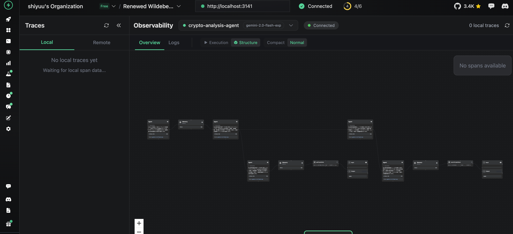

# 🚀 VoltAgentで始めるAIエージェント開発入門

## TypeScript + AI = ✨

---

## 📋 アジェンダ

<div class="compact-list">

1. **🧠 AIエージェント基礎**
2. **🎭 AIエージェントの2つのタイプ**
3. **🤔 VoltAgentとは?** 
4. **👥 マルチエージェント**
5. **🔗 ツール連携** 
6. **🎯 統一API**
7. **📊 可観測性（VoltOps）**
8. **🧠 メモリ管理**
9. **💻 実装デモ（1）**
10. **💻 実装デモ（2）**

</div>

---

## 🎯 今日のゴール


###  <!--fit--> VoltAgentで暗号通貨分析AIエージェントを構築

サンプルリポジトリ: https://github.com/shiyuu33/sample-agent

---

## 1. 🧠 AIエージェント基礎

### 🎯 **AIエージェントとは**

<h3 class="highlight">

自律的に目標を達成するアプリケーションであり、従来のプログラムと異なり、環境を認識し、自ら意思決定を行うことができます

</h3>

### 🏗️ **AIエージェントの3つの構成要素**

<div class="tech-grid">
<div class="tech-card">

### 🧠 **Model**
**大規模言語モデル（LLM）**
<div class="compact-list">

- 推論・判断・意思決定
- 自然言語理解と生成
- Gemini・GPT-4o・Claude等

</div>
</div>
<div class="tech-card">

### 🔧 **Tools**
**外部連携の手段**
<div class="compact-list">

- API呼び出し・DB接続
- ファイル操作・Web検索
- 外部システム連携

</div>
</div>
<div class="tech-card">

### 🎭 **Orchestration**
**全体統括の「指揮者」**
<div class="compact-list">

- 思考と計画
- 記憶管理（メモリ）
- ツール選択・実行制御

</div>

</div>
</div>

- https://google.github.io/adk-docs/agents/
- https://www.kaggle.com/whitepaper-agents

---

## 2. 🎭 AIエージェントの2つのタイプ

<div class="tech-grid-multiple">
<div class="tech-card">

### 🔄 **Workflowタイプ**
**事前定義ロジック**
- **予測可能性**: 高い
- **適用場面**: 定型タスク
- **例**: データ収集→分析→レポート

</div>
<div class="tech-card">

### 🤖 **Agentタイプ**
**自律的判断**
- **柔軟性**: 高い
- **適用場面**: 複雑・非定型タスク
- **例**: 状況に応じて判断

</div>
</div>

### 🎯 **使い分けの判断基準**
- **課題の性質**: 定型 vs 非定型
- **自律性のレベル**: 制御 vs 柔軟性
- **コスト**: 処理時間・API呼び出し回数

https://google.github.io/adk-docs/agents/

---

## 3. 🤔 VoltAgentとは?

### 🌟 **VoltAgentプロジェクトの概要**

<h3 class="highlight">

TypeScriptで構築されたAIエージェントフレームワーク

</h3>

### 🚀 **VoltAgentの主な特徴**

<div class="tech-grid">
<div class="tech-card">

### 👥 **マルチエージェント**
<div class="compact-list">

- 複数エージェント連携
- 効率的タスク処理
- 専門化による精度向上

</div>
</div>
<div class="tech-card">

### 🔗 **豊富なツール連携**
<div class="compact-list">

- 外部システム・SaaS連携
- タスク自動化促進
- API・DB・ファイル操作

</div>
</div>
<div class="tech-card">

### 🎯 **統一したAPI**
<div class="compact-list">

- 複数LLMプロバイダ対応
- 一貫したインターフェース
- 簡単なプロバイダ切り替え

</div>

</div>
</div>

<div class="tech-grid">
<div class="tech-card">

### 📊 **可観測性（VoltOps）**
<div class="compact-list">

- エージェント動作可視化
- デバッグの最適化/効率化
- リアルタイム監視

</div>
</div>
<div class="tech-card">

### 🧠 **メモリ管理**
<div class="compact-list">

- 会話履歴自動管理
- 永続化ストレージ対応
- コンテキスト管理

</div>
</div>
<div class="tech-card">

### 🌐 **MCP Protocol**
<div class="compact-list">

- 外部ツール連携プロトコル
- 標準化インターフェース
- 拡張性確保

</div>

</div>
</div>

https://voltagent.dev/

---

## 4. 👥 マルチエージェントアーキテクチャ

### 🎯 **複数エージェントによる連携**

<h3 class="highlight">

複数の専門エージェントが連携して、複雑なタスクを効率的に処理

</h3>

<div class="code-box">

```typescript
// src/index.ts - 実際のプロジェクトコード
// メイン暗号通貨分析エージェント（司令塔）
const cryptoAgent = new Agent({
  name: "crypto-analysis-agent",
  instructions: "暗号通貨の市場データ分析、ニュース収集、包括的レポート生成",
  model: google("gemini-2.0-flash-exp"),
  tools: [cryptoDataTool, cryptoNewsSearchTool, cryptoAnalysisTool],
  memory,
});

// 市場データ専門サブエージェント
const cryptoDataAnalyst = new Agent({
  name: "crypto-data-analyst",
  instructions: "CoinGecko APIで価格、時価総額、取引量などを収集・分析",
  tools: [cryptoDataTool],  // 専門化：市場データのみ
  memory,
});

// ニュース分析専門サブエージェント  
const cryptoNewsAnalyst = new Agent({
  name: "crypto-news-analyst",
  instructions: "News APIでニュース収集、センチメント分析、影響評価",
  tools: [cryptoNewsSearchTool],  // 専門化：ニュースのみ
  memory,
});
```

</div>

https://blog.langchain.com/langgraph-multi-agent-workflows/

---

## 5. 🔗 豊富なツール連携


### 🌐 **実際のツール実装例**

<div class="code-box">

```typescript
// src/tools/crypto.ts - CoinGecko API連携
export const cryptoDataTool = createTool({
  name: "getCryptoData",
  description: "指定された暗号通貨の市場データを取得",
  parameters: z.object({
    cryptoId: z.string().describe("暗号通貨ID（bitcoin, ethereum等）"),
    vs_currencies: z.array(z.string()).optional().default(["usd", "jpy"])
  }),
  execute: async ({ cryptoId, vs_currencies = ["usd", "jpy"] }) => {
    const response = await axios.get(
      `${config.apis.coinGecko.baseUrl}/coins/${cryptoId}`
    );
    const cryptoData = makeCoinGeckoResponse(response.data, vs_currencies);
    return {
      data: cryptoData,
      analysis: {
        volume: analyzeVolume(cryptoData.total_volume_usd),
        volatility: analyzeVolatility(cryptoData.price_change_percentage_24h)
      }
    };
  },
});
```

</div>

---

## 6. 🎯 統一されたAPI

### 🌐 **複数LLMプロバイダ対応の一貫したインターフェース**

<h3 class="highlight">

Gemini、GPT-4、Claude等、異なるLLMプロバイダを統一APIで簡単切り替え

</h3>

### 🔄 **実際のLLMプロバイダ設定**

<div class="code-box">

```typescript
// src/index.ts - 実際のプロジェクトコード
import { google } from "@ai-sdk/google";

const cryptoAgent = new Agent({
  name: "crypto-analysis-agent",
  model: google("gemini-2.0-flash-exp"),  // Gemini 2.0
  tools: [cryptoDataTool, cryptoNewsSearchTool, cryptoAnalysisTool],
});

// 他のプロバイダへの切り替えも簡単
// import { openai } from "@ai-sdk/openai";
// model: openai("gpt-4o"),

// import { anthropic } from "@ai-sdk/anthropic";  
// model: anthropic("claude-3-sonnet"),
```

</div>

---

## 7. 📊 可観測性（VoltOps）


### 📈 **VoltOpsの監視機能**

<div class="tech-grid">
<div class="tech-card">

### 🔍 **リアルタイム監視**
<div class="compact-list">

- エージェント間通信追跡
- ツール実行状況表示
- エラー発生の即座検出

</div>
</div>
<div class="tech-card">

### 📊 **パフォーマンス分析**
<div class="compact-list">

- レスポンス時間計測
- 成功率・失敗率統計
- リソース使用量監視

</div>
</div>
<div class="tech-card">

### 🐛 **デバッグ支援**
<div class="compact-list">

- ステップ実行表示
- 変数・状態検査
- 詳細ログ出力

</div>
</div>
</div>

<div style="text-align:center">
  
  

</div>

https://voltagent.dev/voltops-llm-observability/

---

## 8. 🧠 メモリ管理


### 🔧 **実際のメモリ設定**

<div class="code-box">

```typescript
// src/index.ts - LibSQL（SQLite）によるメモリ永続化
import { Memory } from "@voltagent/core";
import { LibSQLMemoryAdapter } from "@voltagent/libsql";

const memory = new Memory({
  storage: new LibSQLMemoryAdapter({
    url: "file:./.voltagent/memory.db",  // SQLiteファイル
    logger: logger.child({ component: "libsql" }),
  }),
});

// 全エージェントで共有メモリを使用
const cryptoAgent = new Agent({
  name: "crypto-analysis-agent",
  tools: [cryptoDataTool, cryptoNewsSearchTool, cryptoAnalysisTool],
  memory,  // 共有メモリ
});
```

</div>


#### 🔄 **VoltAgentのメモリ管理機能**

<div class="tech-grid">
<div class="tech-card">

### 💬 **会話履歴管理**
<div class="compact-list">

- やり取りの一貫性
- 自動履歴管理
- 文脈の永続化

</div>
</div>
<div class="tech-card">

### 💾 **ストレージオプション**
<div class="compact-list">

- **デフォルト**: SQLite
- **大規模**: PostgreSQL等
- メモリ永続化

</div>
</div>
<div class="tech-card">

### 🎛️ **Agentクラス**
<div class="compact-list">

- 動作制御
- メモリ管理司令塔
- ツール利用調整

</div>
</div>
</div>

---

## 9. 💻 実装デモ（1）

### 🎬 実演デモシナリオ

```bash
# エージェントに質問
"イーサリアムについて市場データ分析とニュース分析を含む包括的なレポートを作成してください"
```

<div class="tech-grid">
<div class="tech-card">

### 🤖 cryptoAgent
**司令塔として判断**
<div class="compact-list">

- ユーザー意図解析
- タスク分解・振り分け
- 結果統合・レポート生成

</div>
</div>
<div class="tech-card">

### 📊 cryptoDataAnalyst  
**市場データ収集**
<div class="compact-list">

- CoinGecko API呼び出し
- 価格・時価総額分析
- ボラティリティ判定

</div>
</div>
<div class="tech-card">

### 📰 cryptoNewsAnalyst
**ニュース分析**
<div class="compact-list">

- News API呼び出し
- センチメント分析
- トレンド把握

</div>

</div>
</div>

---

## 10. 💻 実装デモ（2）

```typescript
// メイン統合エージェント（司令塔役）
const cryptoAgent = new Agent({
  name: "crypto-analysis-agent",
  instructions: "暗号通貨の包括的分析レポートを生成...",
  tools: [cryptoDataTool, cryptoNewsSearchTool, cryptoAnalysisTool]
});

// データ分析専門サブエージェント
const cryptoDataAnalyst = new Agent({
  name: "crypto-data-analyst", 
  instructions: "CoinGecko APIで市場データ収集・分析...",
  tools: [cryptoDataTool]  // 価格・時価総額・取引量
});

// ニュース分析専門サブエージェント  
const cryptoNewsAnalyst = new Agent({
  name: "crypto-news-analyst",
  instructions: "News APIでニュース収集・センチメント分析...", 
  tools: [cryptoNewsSearchTool]  // ニュース・センチメント
});

new VoltAgent({
  agents: { cryptoAgent, cryptoDataAnalyst, cryptoNewsAnalyst },
  // workflows: { cryptoAnalysisWorkflow }
});
```


---
## 🤝 ご清聴ありがとうございました！

### 📚 **Resources**
- **GitHub**: https://github.com/VoltAgent/voltagent
- **Docs**: https://voltagent.dev/docs
